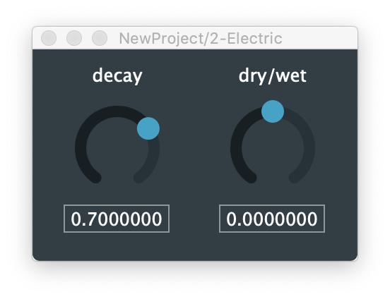

# Peverb

This repository contains a (if I may say so myself) rather nice sounding reverb implemented in C++/JUCE.

The reverb algorithm is based on time-varying nested all-pass filters with pre-computed early reflections with some binaural processing.

Just open the project in projucer and everything should compile nicely, except the legacy VST plug-in.

This repository also contains two audio examples: *demo_electric_pino_1.mp3* and *demo_drums_1.mp3*. Both examples starts off without the effect, the effect is then gradually introduced, 
and lastly the decay is brought up to end with a long reverb tail.

# License

Copyright 2020 Pelle Juul Christensen

Permission is hereby granted, free of charge, to any person obtaining a copy of this software and associated documentation files (the "Software"), to deal in the Software without restriction, including without limitation the rights to use, copy, modify, merge, publish, distribute, sublicense, and/or sell copies of the Software, and to permit persons to whom the Software is furnished to do so, subject to the following conditions:

The above copyright notice and this permission notice shall be included in all copies or substantial portions of the Software.

THE SOFTWARE IS PROVIDED "AS IS", WITHOUT WARRANTY OF ANY KIND, EXPRESS OR IMPLIED, INCLUDING BUT NOT LIMITED TO THE WARRANTIES OF MERCHANTABILITY, FITNESS FOR A PARTICULAR PURPOSE AND NONINFRINGEMENT. IN NO EVENT SHALL THE AUTHORS OR COPYRIGHT HOLDERS BE LIABLE FOR ANY CLAIM, DAMAGES OR OTHER LIABILITY, WHETHER IN AN ACTION OF CONTRACT, TORT OR OTHERWISE, ARISING FROM, OUT OF OR IN CONNECTION WITH THE SOFTWARE OR THE USE OR OTHER DEALINGS IN THE SOFTWARE.
